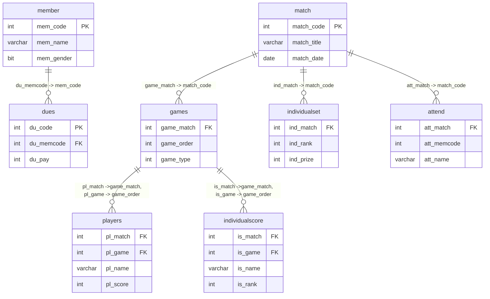

# 📘 Club Management Database Schema

---
## ✍ 다이어그램
<details> <summary> 상세보기 </summary>
	


</details>

---

## 🧱 데이터베이스 테이블 목록

<details><summary> 상세보기 </summary>
  
  ### 🔹 config 테이블
  > 프로그램 구성 설정을 위한 테이블입니다.
> 프로그램 시작일, 각 테이블의 최신 채번코드, 핸디캡 점수 등 설정 정보가 있습니다

  📋**컬럼 구성**
  
  | 칼럼명 | 자료형 | NULL 여부 | PK/Index | 참조 관계 | 설명 |
  |--------|----------|------------|------|------|-------|
  | cf_code | int | ❌ | PK |  | 설정 코드 |
  | cf_title | varchar | ❌ | | | 설정 항목이름 |
  | cf_value | int | ❌ |  |  |설정 값 |
  | cf_strval | varchar | ✅ | |  | 설정 텍스트 값 |
  | cf_edate | datetime | ✅ |  |  |수정일 |

  <br>

  ### 🔹 member 테이블
  > 동호회 회원 정보를 저장하는 테이블입니다. 이름, 성별, 상태, 직책 등의 정보를 포함합니다.
  📋**컬럼 구성**
    
  | 칼럼명 | 자료형 | NULL 여부 | PK/Index | 참조 관계 | 설명 |
  |--------|--------|-----------|----------|-----------|------|
  | mem_code | int | ❌ | PK |  | 회원 코드 |
  | mem_name | varchar(50) | ❌ |  |  | 이름 |
  | mem_birth | varchar(4) | ✅ |  |  | 출생 연도 |
  | mem_gender | bit | ❌ |  |  | 성별 |
  | mem_position | int | ✅ |  |  | 직책 |
  | mem_pro | int | ✅ |  |  | 프로 여부 |
  | mem_status | int | ❌ |  |  | 회원 상태 |
  | mem_access | date | ❌ |  |  | 가입일 |
  | mem_secess | date | ❌ |  |  | 탈퇴일 |
  | mem_memo | varchar(100) | ✅ |  |  | 메모 |
  | mem_idate | datetime | ✅ |  |  | 등록일 |
  | mem_udate | datetime | ✅ |  |  | 수정일 |
  | mem_grade | int | ✅ |  |  | 회원등급(2025-07-20 추가) |
  
  <br>
  
  ### 🔹 dues 테이블
  > 회비 납부 및 지출 이력을 저장하는 테이블입니다.
  📋**컬럼 구성**
  
  | 칼럼명 | 자료형 | NULL 여부 | PK/Index | 참조 관계 | 설명 |
  |--------|--------|-----------|----------|-----------|------|
  | du_code | int | ❌ | PK |  | 회비 코드 |
  | du_memcode | int | ✅ | FK | member(mem_code) | 회원 코드 |
  | du_date | date | ❌ |  |  | 일자 |
  | du_apply | int | ✅ |  |  | 적용 금액 |
  | du_pay | int | ✅ |  |  | 납부 금액 |
  | du_type | int | ❌ |  |  | 유형 (회비/지출/면제/기타입금 등) |
  | du_status | int | ❌ |  |  | 상태 |
  | du_memo | varchar(100) | ✅ |  |  | 메모 |
  | du_idate | datetime | ✅ |  |  | 등록일 |
  | du_udate | datetime | ✅ |  |  | 수정일 |
  
  <br>
  
   ### 🔹 attend 테이블
  > 회원이 특정 모임에 참가한 내역을 기록합니다. 개별 회원의 경기 참여 정보, 핸디캡, 성별, 프로 여부 등의 정보 포함하며, 경기 기록 시 게임별 참석자 등록을 위한 기초 정보 입니다
    
  📋**컬럼 구성**
  
  | 칼럼명 | 자료형 | NULL 여부 | PK/Index | 참조 관계 | 설명 | 비고 |
  |--------|--------|-----------|----------|-----------|------|
  | att_match | int | ❌ | FK , IDX_attend| match(match_code) | 경기 코드 | |
  | att_memcode | int | ✅ |  |  | 회원 코드 | |
  | att_name | varchar(50) | ✅ |  |  | 이름 | |
  | att_memtype | int | ❌ |  |  | 회원 구분 ( 1= 회원, 0 = 비회원) | |
  | att_gender | bit | ❌ |  |  | 성별 | |
  | att_pro | bit | ✅ |  |  | 프로 여부 | |
  | att_handi | int | ✅ |  |  | 핸디 | |
  | att_individual | bit | ✅ |  |  | 개인전 여부 | |
  | att_allcover | bit | ✅ |  |  | 올커버 여부 | |
  | att_average | decimal | ✅ |  |  | 기준 에버 | 2025-07-15 추가 |

  <br>

  ### 🔹 match 테이블
  > 모임 관리와 게임 기록을 위한 모임 단위 정보를 저장하는 마스터 테이블입니다.

📋**컬럼 구성**
  
  | 칼럼명 | 자료형 | NULL 여부 | PK/Index | 참조 관계 | 설명 |
  |--------|--------|-----------|----------|-----------|------|
  | match_code | int | ❌ | PK |  | 경기 코드 |
  | match_date | date | ❌ |  |  | 경기 일자 |
  | match_type | int | ❌ |  |  | 경기 유형 |
  | match_title | varchar(100) | ✅ |  |  | 제목 |
  | match_memo | varchar(100) | ✅ |  |  | 메모 |
  | match_recode | int | ✅ |  |  | 기록 여부 |
  | match_idate | datetime | ✅ |  |  | 등록일 |
  | match_udate | datetime | ✅ |  |  | 수정일 |
    
  <br>
  
  ### 🔹 games 테이블
  > match에 속한 개별 게임 목록입니다. 한 경기에는 여러 게임이 있을 수 있으며, 게임 순번과 타입을 관리합니다.

  📋**컬럼 구성**
  
  | 칼럼명 | 자료형 | NULL 여부 | PK/Index | 참조 관계 | 설명 |
  |--------|--------|-----------|----------|-----------|------|
  | game_match | int | ❌ | PK, FK | match(match_code) | 경기 코드 |
  | game_order | int | ❌ | PK |  | 경기 순번 |
  | game_type | int | ❌ |  |  | 경기 타입 |
  | game_player | int | ✅ |  |  | 플레이어 수 |
  
  <br>
  
  ### 🔹 players 테이블
  > 각 게임별 출전 선수 정보를 저장합니다.

  📋**컬럼 구성**
    
  | 칼럼명 | 자료형 | NULL 여부 | PK/Index | 참조 관계 | 설명 |
  |--------|--------|-----------|----------|-----------|------|
  | pl_match | int | ❌ | FK ,IDX_players | games(game_match) | 경기 코드 |
  | pl_game | int | ❌ | FK ,IDX_players| games(game_order) | 게임 순번 |
  | pl_group | int | ❌ |  |  | 그룹 번호 |
  | pl_member | int | ✅ |  |  | 회원 코드 |
  | pl_name | varchar(50) | ❌ |  |  | 이름 |
  | pl_score | int | ✅ |  |  | 점수 |
  | pl_allcover | bit | ✅ |  |  | 올커버 여부 |    
  
  <br>
  
  ### 🔹individualscore  테이블
  > 사이드 게임 개인전 결과를 저장하는 테이블로, 이름/순위/핸디 등 정보가 기록됩니다. 회원 여부와 관계없이 기록 가능합니다.

    📋**컬럼 구성**
  
  | 칼럼명 | 자료형 | NULL 여부 | PK/Index | 참조 관계 | 설명 |
  |--------|--------|-----------|----------|-----------|------|
  | is_match | int | ❌ | IDX_individualscore |  | 경기 코드 |
  | is_game | int | ❌ | IDX_individualscore |  | 게임 순번 |
  | is_name | varchar(50) | ❌ |  |  | 이름 |
  | is_memcode | int | ✅ |  |  | 회원 코드 |
  | is_rank | int | ❌ |  |  | 순위 |
  | is_handi | int | ✅ |  |  | 핸디 |
  
  <br>
  
  ### 🔹individualset  테이블
  > 사이드 게임 개인전 순위별 보상 설정 테이블입니다. 경기별로 순위에 따른 상금 및 핸디 정보를 포함합니다.

📋**컬럼 구성**
  
  | 칼럼명 | 자료형 | NULL 여부 | PK/Index | 참조 관계 | 설명 |
  |--------|--------|-----------|----------|-----------|------|
  | ind_match | int | ❌ | PK, FK | match(match_code) | 경기 코드 |
  | ind_rank | int | ❌ | PK |  | 순위 |
  | ind_prize | int | ✅ |  |  | 상금 |
  | ind_handi | int | ✅ |  |  | 핸디 보정 |

  <br>

  ### 🔹grade  테이블
  > 회원 등급 설정을 위한 테이블입니다. (2025-07-20 추가)

📋**컬럼 구성**
  
  | 칼럼명 | 자료형 | NULL 여부 | PK/Index | 참조 관계 | 설명 |
  |--------|--------|-----------|----------|-----------|------|
  | grd_code | int | ❌ | PK |  | 등급 코드 |
  | grd_name | nvarchar(10) | ❌ |  |  | 등급명 |
  | grd_udate | datetime | ✅ |  |  | 수정일 |
  
  <br>
</details>

---

## ⚙️ 저장 프로시저 목록

<details>
  <summary>상세 보기</summary>

  ### usp_UpdateConfig [환경설정 채번 코드 수정]
  > 회원, 회비 입출금, 모임 등 각 항목의 최신 채번코드를 업데이트 하는 프로시저입니다.
  > 신규 등록 후 각 항목에서 공통으로 사용할 수 있으며, 각 항목 마다 고유 코드 (cf_code)가 다릅니다. 
```sql
CREATE PROCEDURE [dbo].[usp_UpdateConfig]
	@code int, 
	@value int,
	@str varchar(50)
AS
BEGIN 
	SET NOCOUNT ON;
	UPDATE config SET cf_value = @value, cf_strval = @str, cf_edate = getdate() WHERE cf_code = @code
END
```
  ### 🔹 usp_InsertMember [회원 등록]
  > 회원 관리에서 새로운 회원 등록시 사용되는 프로시저입니다.

  ```sql
  CREATE PROCEDURE [dbo].[usp_InsertMember]
  	@name varchar(30),
  	@status int,
  	@birth varchar(4),
  	@gender int,
  	@position int,
  	@memo varchar(100),
  	@access date,
  	@pro int
  AS
  BEGIN
  	SET NOCOUNT ON;
  	DECLARE @memcode int
  	SET @memcode = (SELECT ISNULL(cf_value, 0) + 1 FROM config WHERE cf_code = 4);
  
  	INSERT INTO member(mem_code, mem_name, mem_status, mem_birth, mem_gender, mem_position, mem_memo, mem_access, mem_pro)
  	VALUES (@memcode, @name, @status, @birth, @gender, @position, @memo, @access, @pro);
  
  	EXEC usp_UpdateConfig @code = 4, @value = @memcode, @str = '';
  END
  ```
### 🔹 usp_UpdateMember [회원 수정]
> 회원정보 수정시 사용되는 프로시저입니다.
```sql
CREATE PROCEDURE [dbo].[usp_UpdateMember]
	@memcode int,
	@name varchar(30),
	@status int,
	@birth varchar(4),
	@gender int,
	@position int,
	@memo varchar(100),
	@access date,
	@secess date
AS 
BEGIN
  SET NOCOUNT ON;
	UPDATE member 
	SET mem_name = @name,
	mem_birth=@birth, 
	mem_status = @status,
	mem_gender = @gender, 
	mem_position = @position, 
	mem_access = @access, 
	mem_secess = @secess,
	mem_memo = @memo 
	WHERE mem_code = @memcode;
END
```

### 🔹 usp_InsertStatment [회비 입출금 내역 등록]
> 회비 관리에서 새로운 입급 또는 출금 내역을 등록시 사용하는 프로시저 입니다
```sql
CREATE PROCEDURE [dbo].[usp_InsertStatment]
	@date date,
	@apply int,
	@type int,
	@amount int,
	@memcode int,
	@detail VARCHAR(50),
	@memo VARCHAR(100)
AS 
BEGIN
	SET NOCOUNT ON;
	DECLARE @stateCode int
	SET @stateCode = (SELECT ISNULL(cf_value, 0) + 1 FROM config WHERE cf_code = 6);

	INSERT INTO dues(du_code, du_date, du_apply, du_type, du_pay, du_memcode, du_detail, du_memo, du_idate, du_udate, du_status) 
	VALUES(@stateCode, @date, @apply, @type, @amount, @memcode, @detail, @memo, GETDATE(), GETDATE(), 1);

	EXEC usp_UpdateConfig @code = 6, @value = @stateCode, @str = '';
END
```
### 🔹 usp_UpdateeStatement [회비 입출금 내역 수정]
> 회비 입출급 내역 정보를 수정하는 프로시저입니다
```sql
CREATE PROCEDURE [dbo].[usp_UpdateeStatement]
	@stateCode int,
	@date date,
	@apply int,
	@type int,
	@amount int,
	@memcode int,
	@detail VARCHAR(50),
	@memo VARCHAR(100)
AS
BEGIN
  SET NOCOUNT ON;
	UPDATE dues 
	SET du_date  = @date, 
	du_apply = @apply, 
	du_type  = @type, 
	du_pay  = @amount, 
	du_memcode = @memcode, 
	du_detail = @detail, 
	du_memo = @memo, 
	du_udate = GETDATE() , 
	du_status = 1 
	WHERE du_code =@stateCode;
END
```
### 🔹 usp_DeletStatment [회비 입출금 내역 삭제]
> 회비 입출금 내역 정보를 무효화 하는 프로시저입니다.
```sql
CREATE PROCEDURE [dbo].[usp_DeletStatment]
	@stateCode int
AS
BEGIN
  SET NOCOUNT ON;
	UPDATE dues SET du_status = 0 WHERE du_code = @stateCode;
END
```

  
### 🔹 usp_InsertMatch [모임 등록]
> 모임관리에서 새로운 모임 등록시 사용되는 프로시저 
 
```sql
CREATE PROCEDURE [dbo].[usp_InsertMatch]
    @title varchar(50),
    @host varchar(30),
    @date date,
    @type int,
    @memo varchar(100)
AS
BEGIN
    SET NOCOUNT ON;
    DECLARE @match int
    SET @match = (SELECT ISNULL(cf_value, 0) + 1 FROM config WHERE cf_code = 5);
  
    INSERT INTO match(match_code, match_title, match_host, match_date, match_type, match_memo, match_record) 
    VALUES(@match, @title, @host, @date, @type, @memo, 0);
 
    EXEC usp_UpdateConfig @code = 5, @value = @match, @str = '';
END
```

### 🔹 usp_UpdateMatch [모임 정보 수정]
> 모임관리에 등록된 모임의 정보를 수정 할 때 사용되는 프로시저 입니다
```sql
CREATE PROCEDURE [dbo].[usp_UpdateMatch]
	@match int,
	@title varchar(50),
	@host varchar(30),
	@date date,
	@type int,
	@memo varchar(100)
AS
BEGIN
	SET NOCOUNT ON;
	UPDATE match 
	SET match_title = @title, 
	match_host = @host, 
	match_date = @date, 
	match_type = @type, 
	match_memo = @memo 
	WHERE match_code = @match;
END
```
### 🔹 usp_UpdateMatchPlayer [모임 참가자 정보 수정]
> 모임관리에서 모임의 참가자 정보 등록 및 수정시 사용하는 프로시저입니다.<br>
> 2025-07-15 기준 에버 쿼리 추가
```sql
CREATE PROCEDURE [dbo].[usp_UpdateMatchPlayer]
	@match int,
	@PlayerList PlayerInfo READONLY
AS 
BEGIN
	SET NOCOUNT ON;

	-- 기존 참석자 삭제
	IF EXISTS (SELECT 1 FROM attend WHERE att_code = @match)
	BEGIN
		DELETE FROM attend WHERE att_code = @match;
	END
	/*기준 에버리지 계산 및 칼럼 2025-07-15 추가*/
	-- 기준 에버리지 계산용 임시 테이블
	DECLARE @Average TABLE ( mem_code INT PRIMARY KEY,average_score FLOAT);
	-- 기준 에버 생성 기준일
	DECLARE @fromdate date, @todate date , @interval int;
	
	SET @interval = (SELECT cf_value FROM config WHERE cf_code = 14)
	SET @todate = (SELECT match_date FROM match WHERE match_code = @match)
	SET @fromdate = DATEADD(MONTH,@interval*-1,@todate)

	-- 필요한 회원만 선별하여 평균 점수 계산
	INSERT INTO @Average (mem_code, average_score)
	SELECT 
		p.player_memcode,
		ROUND( CASE WHEN COUNT(pl.pl_score) > 0 THEN CAST(SUM(a.att_handi + pl.pl_score) AS DECIMAL) / COUNT(pl.pl_score)ELSE 0 END, 2) AS average_score
	FROM @PlayerList p
	JOIN member m ON m.mem_code = p.player_memcode AND m.mem_status != 2
	LEFT JOIN attend a ON m.mem_code = a.att_memcode
	LEFT JOIN (SELECT match_code FROM match WHERE match_type = 1 AND match_date >= @fromdate AND match_date <  @todate) mt ON a.att_code = mt.match_code
	LEFT JOIN players pl ON mt.match_code = pl.pl_match AND pl.pl_member = a.att_memcode AND pl.pl_score != 0
	GROUP BY p.player_memcode;

	-- 참석자 입력 (기준 에버리지 포함)
	INSERT INTO attend (att_code, att_name, att_memcode, att_memtype, att_gender, att_pro, att_handi, att_side, att_allcover, att_average)
	SELECT 
		@match, player_name, player_memcode, CASE WHEN player_memcode = 0 THEN 2 ELSE 1 END, player_gender, player_isPro, player_handicap,0, 0, ISNULL(avg.average_score, 0)
	FROM @PlayerList p LEFT JOIN @Average avg ON p.player_memcode = avg.mem_code;
END
```
### 🔹 usp_InsertGames [게임 등록]
> 게임 기록에서 선택된 모임의 게임을 등록하는 프로시저 입니다.
> 한 모임에 다수의 게밍을 등록 할 수 있으며, 프로그램에서 기존 게임을 수정 하더라도 삭제 후 재등록 하는 방식으로 사용됩니다.
```sql
CREATE PROCEDURE [dbo].[usp_InsertGames]
	@match int,
	@gamelist dbo.GameInfo READONLY
AS
BEGIN
	SET NOCOUNT ON;
	IF EXISTS( SELECT 1 FROM games WHERE game_match =  @match)
		BEGIN 
			DELETE FROM games WHERE game_match = @match
		END
	INSERT INTO games(game_match, game_order, game_type, game_player)
	SELECT @match, game_order, game_type, game_player
	FROM @gamelist

	UPDATE match SET match_record = 1 WHERE match_code = @match
END
```
### 🔹 usp_InsertGamePlayer [게임 플레이어 등록]
> 게임 기록에서 각 게임, 그룹별 참가자 설정 시 플레이어 등록 하는 사용하는 프로시저입니다.
> 수정 시에도 기존 사용자 모두 삭제 후 재등록 하는 방식으로 사용 됩니다.
```sql
CREATE PROCEDURE [dbo].[usp_InsertGamePlayer]
    @match INT,
    @game INT,
    @group INT,
    @PlayerList dbo.PlayerInfo READONLY
AS
BEGIN
	IF EXISTS (SELECT 1 FROM players WHERE pl_match = @match AND pl_game = @game AND pl_group = @group)
	BEGIN
		DELETE FROM players WHERE pl_match = @match AND pl_game = @game AND pl_group = @group
	END

	INSERT INTO players(pl_match, pl_game, pl_group, pl_member,pl_name,pl_score)
	SELECT @match, @game, @group, player_memcode, player_name,player_score  
	FROM @playerList;
END
```
### 🔹 usp_UpdatePlayerOption [게임 플레이어 옵션 설정]
>게임 기록에서 참가자의 성별, 프로 핸디 설정과 사이드게임 참여 여부 설정 시 사용되는 프로시저입니다.
```sql
CREATE PROCEDURE [dbo].[usp_UpdatePlayerOption]
	@match int,
	@name varchar(30),
	@gender int,
	@isPro int,
	@individual int,
	@allcover int,
	@handi int 
AS
BEGIN 
	SET NOCOUNT ON;
	UPDATE attend 
	SET att_gender = @gender, 
	att_pro = @isPro, 
	att_individual = @individual, 
	att_allcover = @allcover, 
	att_handi = @handi
    WHERE att_match = @match AND att_name = @name
END
```
### 🔹 usp_InsertIndividaulRank [사이드게임 개인전 순위 등록]
> 게임 기록에서 사이드 게임 개인전에 순위 등록
```sql
CREATE PROCEDURE [dbo].[usp_InsertIndividaulRank]
	@match int,
	@game int,
	@IndiviDualRanks IndividualPlayer READONLY
AS
BEGIN
	SET NOCOUNT ON;
	IF EXISTS(SELECT 1 FROM individualscore WHERE is_match = @match AND is_game = @game)
	BEGIN
		DELETE FROM individualscore WHERE is_match = @match AND is_game = @game
	END
	INSERT INTO individualscore ( is_match, is_game, is_name, is_rank, is_handi) 
	SELECT  @match, @game, indp_name, indp_rank,  indp_handi FROM @IndiviDualRanks
END
```
### 🔹 usp_SetIndividualOption[사이드게임 개인전 보상 설정]
> 게임 기록에서 사이드게임 개인전의 순위 보상 및 핸디 설정 등록시 사용하는 프로시저 입니다
```sql
CREATE PROCEDURE [dbo].[usp_SetIndividualOption]
	@match int, 
	@individualList IndividualOption READONLY
AS
BEGIN
	SET NOCOUNT ON;
	IF EXISTS(SELECT 1 FROM individualset WHERE ind_match = @match)
		BEGIN
			DELETE FROM individualset WHERE ind_match = @match
		END
	INSERT INTO individualset(ind_match,  ind_rank, ind_prize, ind_handi)
	SELECT @match, indo_rank, indo_prize, indo_handi FROM @individualList
END
```
### 🔹 usp_UpdatePlayerScore [점수 입력]
> 게임 기록에서 플레이어 점수를 입력할 때 사용하는 프로시저 입니다.

```SQL
 CREATE PROCEDURE [dbo].[usp_UpdatePlayerScore]
	@match int,
	@game int,
	@name varchar(30),
	@allcover tinyint,
	@score int
AS 
BEGIN 
	SET NOCOUNT ON;
	UPDATE players 
	SET pl_score = @score , pl_allcover = @allcover 
	WHERE pl_match = @match AND pl_game = @game AND pl_name = @name
END 
```

### 

</details>

---

## 🧩 사용자 정의 테이블 형식 (TVP)

<details>
  <summary>상세보기</summary>
  
  ### 🔹 GameInfo 
> 매치에 포함된 여러 게임 정보를 일괄적으로 등록할 때 사용됩니다.

**🛠️ 사용 프로시저:**  
- `usp_InsertGames`

**📋 컬럼 구성:**

| 컬럼명 | 데이터형 | NULL 여부 | 설명 |
|--------|-----------|------------|------|
| game_order | int | ✅ | 게임 순서 |
| game_type | int | ✅ | 게임 유형 |
| game_player | int | ✅ | 참여 인원 |
| game_side | int | ✅ | 사이드 여부 |
| game_allcover | int | ✅ | 올커버 여부 |

<br>

---

### 🔹 IndividualOption
> 개인전의 각 순위별 상금 및 핸디캡 정보를 일괄 등록할 때 사용됩니다.

**🛠️ 사용 프로시저:**  
- `usp_SetIndividualOption`

**📋 컬럼 구성:**

| 컬럼명 | 데이터형 | NULL 여부 | 설명 |
|--------|-----------|------------|------|
| indo_rank | int | ❌ | 순위 |
| indo_prize | int | ❌ | 상금 |
| indo_handi | int | ✅ | 핸디캡 |

<br>

---

### 🔹 IndividualPlayer

> 게임 종료 후 사이드 게임 개인전의 플레이어들의 순위 및 핸디 정보를 기록하기 위해 사용됩니다.

**🛠️ 사용 프로시저:**  
- `usp_InsertIndividaulRank`

**📋 컬럼 구성:**

| 컬럼명 | 데이터형 | NULL 여부 | 설명 |
|--------|-----------|------------|------|
| indp_name | varchar(30) | ❌ | 플레이어 이름 |
| indp_handi | int | ❌ | 핸디캡 |
| indp_rank | int | ❌ | 순위 |

<br>

---

### 🔹 PlayerInfo

> 선수 등록, 참가자 명단 구성, 점수 입력 등 다양한 상황에서 사용됩니다.

**🛠️ 사용 프로시저:**  
- `usp_InsertGamePlayer`
- `usp_UpdateMatchPlayer`

**📋 컬럼 구성:**

| 컬럼명 | 데이터형 | NULL 여부 | 설명 |
|--------|-----------|------------|------|
| player_memcode | int | ✅ | 회원 코드 |
| player_name | varchar(20) | ✅ | 이름 |
| player_gender | tinyint | ✅ | 성별 |
| player_handicap | int | ✅ | 핸디캡 |
| player_isPro | tinyint | ✅ | 프로 여부 |
| player_individual | tinyint | ✅ | 개인전 여부 |
| player_allcover | tinyint | ✅ | 올커버 여부 |
| player_isAllcover | tinyint | ✅ | 올커버 여부2 |
| player_score | int | ✅ | 점수 |


</details>
